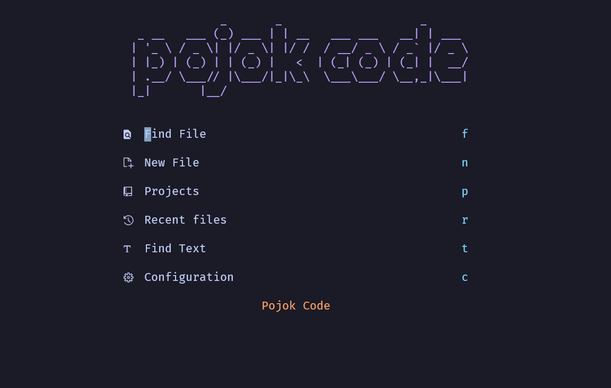

# lunarvim-config-manual (Windows)
## HOME

## Kebutuhan dasar 
1. Install Neovim 8.0+ https://github.com/neovim/neovim/releases/tag/stable 
2. C++ Compiler https://www.msys2.org/ 
3. GIT https://git-scm.com/download/win 
4. NodeJs https://nodejs.org/en/
5. Ripgrep https://github.com/BurntSushi/ripgrep 
6. Lazygit  https://github.com/jesseduffield/lazygit 
7. Nerd Font https://github.com/ryanoasis/nerd-fonts
8. Windows Terminal https://apps.microsoft.com/store/detail/windows-terminal/9N0DX20HK701?hl=en-id&gl=id 
9. Powershell https://apps.microsoft.com/store/detail/powershell/9MZ1SNWT0N5D?hl=en-id&gl=id 
## Lakukan clone dari lunarvim 
```
git clone https://github.com/LunarVim/LunarVim.git "$env:LOCALAPPDATA\nvim"
git clone https://github.com/pojokcodeid/lunarvim-config-manual.git "$env:LOCALAPPDATA\nvim\lua\user"
```
## Lakukan Call Function pada file nvim/config.lua  paling bawah 
```
require("user.config")
```
## Copy Snippet 
```
 Copy-Item -Path "$env:LOCALAPPDATA\nvim\lua\user\snippets" -Destination "$env:LOCALAPPDATA\nvim\snippets" -Recurse
```
## Copy untuk java di windows 
```
Copy-Item -Path "$env:LOCALAPPDATA\nvim\lua\user\ftplugin" -Destination "$env:LOCALAPPDATA\nvim\ftplugin" -Recurse
```

# Linux Config 
```
visudo
asep ALL=(ALL:ALL) ALL
asep ALL=(ALL) NOPASSWD:ALL 
```
## Persiapan
```
sudo apt install build-essential libssl-dev
curl -o- https://raw.githubusercontent.com/nvm-sh/nvm/v0.35.3/install.sh | bash
source ~/.bashrc
nvm install 18.12.0

sudo apt-get install unzip
sudo apt-get install ripgrep

https://github.com/jesseduffield/lazygit#ubuntu
```
## Config
```
git clone https://github.com/LunarVim/LunarVim.git ~/.config/nvim
git clone https://github.com/pojokcodeid/lunarvim-config-manual.git ~/.config/nvim/lua/user
```
## Lakukan Call Function pada file nvim/config.lua  paling bawah 
```
require("user.config")
```
### Copy Snippets
```
 cp -r ~/.config/nvim/lua/user/snippets ~/.config/nvim/snippets
```

